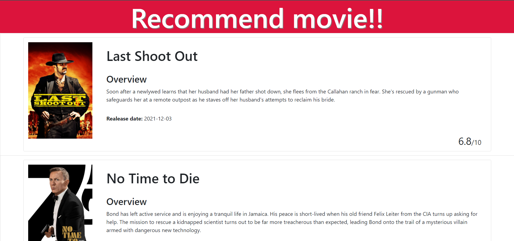

# Fetch-And-Render-Data-Coding-Challenge-Week15-
<div>

</div>

## Description:
  This is assignment from ***Professional Certificate in Coding: Full Stack Development with MERN*** Week15.</br>
  This program consists of javascript, html, and css.
  This program is Todo list. If you are done with your task and push "Done", then window asks if you want to remove the task from Todo list.

## Installation:
  1. Downloads each file into one file. <br>
    1. **index.html** <br>
    2. **index.jsx** <br>
    3. **style.css** <br>
  3. Open shell and type **npm install --global http-server**.
     ```console
     npm install --global http-server
     ```
  4. Type **npm install**.
     ```console
     npm install
     ```
  5. type **http-server -c-1** to start the server.
     ```console
     http-server -c-1
     ```
  6. Go online and type **localhost:8080** in URL box.

  
## Usage:
**[Live app](https://kojiroasano.github.io/ToDo-List-Week14-/)**
  <p>If successfully installed and run on the Web browser, the Todo list shows up. If you could not deal with daily work, try my todo list!!</p>
  
## Support:
  If any question, message me via **[my twitter](https://twitter.com/Kojiro38895598)**.
  
## Roadmap:
  I want to sophisticate styling.
  
## License information: 
 If you use the part of this code in your program and show it to public, please include the name of ***MIT***.
 API retrives from **[here](https://developers.themoviedb.org/4/getting-started/authorization)**
 
 

